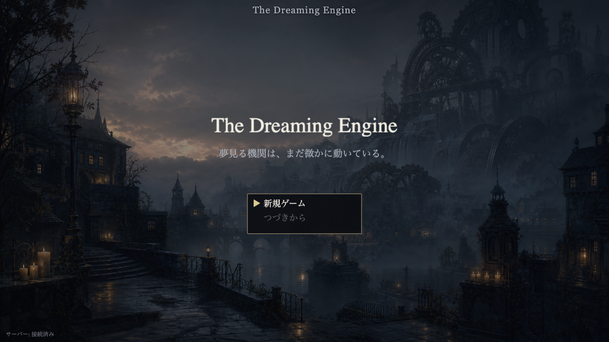
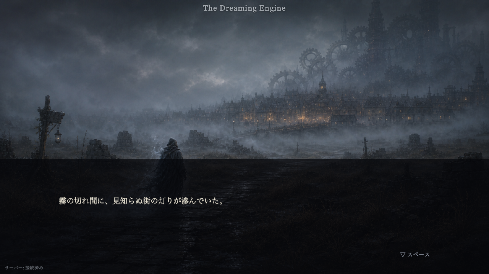
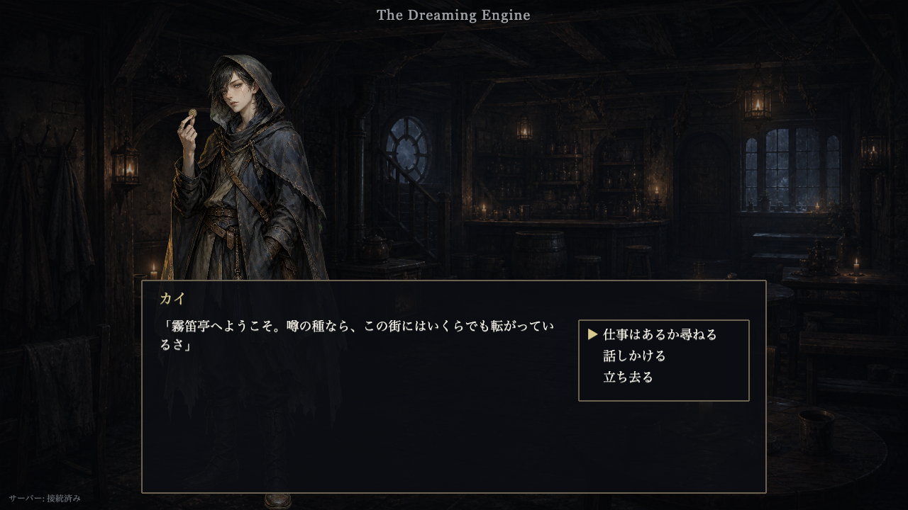
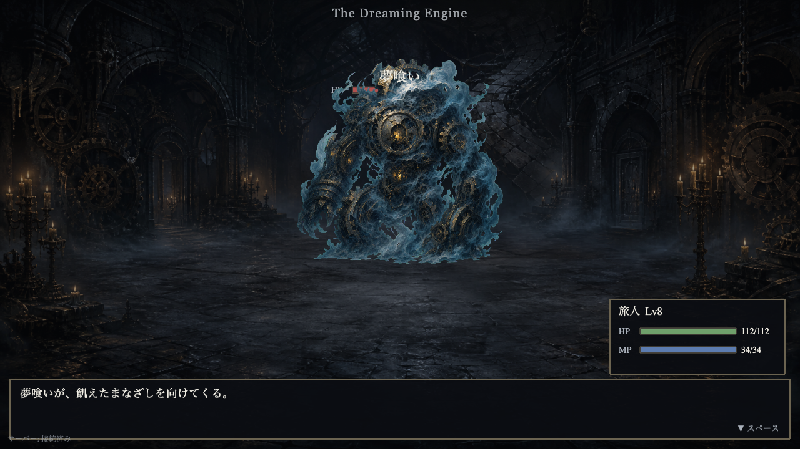
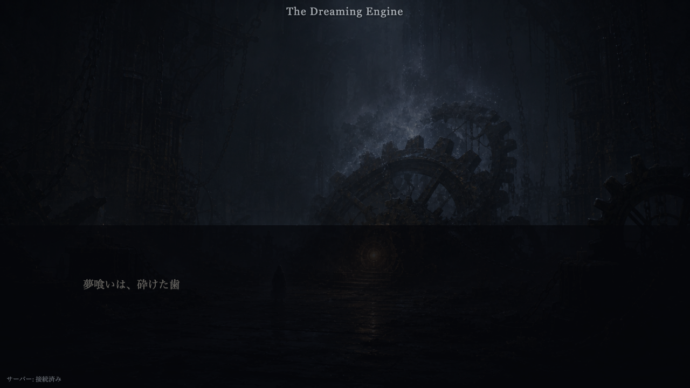

# The Dreaming Engine

ゲーム実行中に生成AI(Claude Agent SDK)を組み込んだ、日本語ダークファンタジー2D RPG。
世界は「夢見る機関」が紡ぐ夢でできており、NPCとの自由会話・サブクエストの動的生成・
宿泊時の夢による世界変化を、多層防御(ai-guardrails)の内側で生成AIが担う。

開発は人間がコードを書かず、**Claude Codeの `/goal`・`/loop` による長時間自律駆動**で行う。
画像アセットの生成のみ、Claude Codeからcodex(Image Gen)へ委譲する。
このREADMEはその駆動手順(人間向け)を説明する。

## 前提

- Node.js 22+ / pnpm
- Claude Code CLI(`/goal`・`/loop` が使えること)
- codex CLI + codex MCP接続(画像アセット生成の委譲先。M5で使用)
- Claudeサブスクリプション(Pro/Max等。ゲーム内AIの認証に使用)

## 初回セットアップ(人間が行う)

1. リポジトリのブランチを確認する(作業ブランチは `claude/dev`。mainへの直接コミットは禁止):

   ```bash
   git checkout claude/dev
   ```

2. ゲーム内AIの認証を設定する。`claude setup-token` で長期OAuthトークンを発行し、
   リポジトリ直下の `.env`(gitignore済み)に置く:

   ```bash
   # .env
   CLAUDE_CODE_OAUTH_TOKEN=sk-ant-oat01-...
   ```

   ※ 実際に使われるのはM4(AI統合)以降の `pnpm test:ai-live` と実プレイ時のみ。
   動作しない・レート制限が問題になる場合は `ANTHROPIC_API_KEY` に差し替え可能
   (詳細: [docs/spec/ai-integration.md](docs/spec/ai-integration.md))

3. ドキュメント一式(`docs/`、`CLAUDE.md`、`docs/spec/world-lore.md` 含む)が
   コミット済みであることを確認する(Claude Codeの中断回収が `git stash` を使うため、
   未コミットの仕様書は消失リスクがある)

## 開発手順(Claude Code駆動)

### Phase 1: 縦切り完成まで — `/goal`

[docs/prompts/goal-vertical-slice.md](docs/prompts/goal-vertical-slice.md) を開き、
`---` で挟まれた本文をそのまま Claude Code の `/goal` に投入する。

- Claude Codeは `CLAUDE.md`(開発憲法)→ `docs/progress/JOURNAL.md`(作業ログ)→
  `docs/progress/ROADMAP.md`(マイルストーン)の順に読み、M0(環境構築)から
  M6(縦切り完成)まで自律的に進める
- 各タスクで `pnpm check`(+M1以降はE2Eスモーク)を緑にしてからコミットする
  規律が組み込まれている
- ゴール: タイトル→メインクエスト→ボス「夢喰い」→エンディングまで通しプレイ可能

### Phase 2: 無限拡張 — `/loop`

縦切り完成後(または途中からでも)、
[docs/prompts/loop-expansion.md](docs/prompts/loop-expansion.md) の `---` で挟まれた
本文を Claude Code の `/loop` に与える。

- 1イテレーション = 「現在地把握→タスク1つ選択→実装→検証緑→コミット→記録」
- ROADMAPが尽きたら [docs/progress/BACKLOG.md](docs/progress/BACKLOG.md) の
  上から順に拡張を続ける(装備システム、新エリア、第2章など)

### 進捗の追い方

| 見る場所 | わかること |
|---|---|
| `docs/progress/JOURNAL.md` の末尾 | 直近の作業内容・既知の問題・次にやること |
| `docs/progress/ROADMAP.md` | マイルストーンのチェック状況 |
| `git log --oneline` | コミット単位の進捗 |
| `pnpm dev:mock` | モックAIで実際に遊んで確認(実AIを消費しない) |

### 人間の役割(Claude Codeは代行できない・してはいけない)

- **実AIの確認**: `pnpm test:ai-live`(実AI疎通+インジェクション攻撃テスト)の実行と、
  `.env` を設定した上での `pnpm dev` での実プレイ確認。Claude Codeが「人間確認待ち」として
  JOURNALに記録した項目を随時消化する
- **優先順位の操縦**: `BACKLOG.md` の並び順の編集(高/中への追加・並び替えは人間のみ)
- **ブロックの解除**: Claude Codeが「ブロック中」と注記して停止・スキップした項目の判断と注記解除
- **ROADMAPの変更**: 既存項目・完了条件の変更・削除・緩和は人間のみ
- **mainへのマージ**: `claude/dev` の成果を確認してマージするタイミングの判断

## ドキュメントマップ

| ファイル | 内容 |
|---|---|
| [CLAUDE.md](CLAUDE.md) | Claude Codeの開発憲法(品質ゲート・禁止事項・作業手順) |
| [AGENTS.md](AGENTS.md) | codex向けの注意(画像アセット生成専用) |
| [docs/spec/game-design.md](docs/spec/game-design.md) | ゲーム仕様(マップ・戦闘・クエスト・セーブ) |
| [docs/spec/world-lore.md](docs/spec/world-lore.md) | 世界観・命名・NPC人物設定の正(ロア) |
| [docs/spec/ai-integration.md](docs/spec/ai-integration.md) | Agent SDK統合・DreamMaster・ツール定義 |
| [docs/spec/ai-guardrails.md](docs/spec/ai-guardrails.md) | ゲーム内AIの多層防御・世界観憲法 |
| [docs/spec/asset-pipeline.md](docs/spec/asset-pipeline.md) | 画像アセット生成(codex委譲)の規約 |
| [docs/prompts/](docs/prompts/) | `/goal`・`/loop` 投入用プロンプト |
| [docs/progress/](docs/progress/) | ROADMAP / JOURNAL / BACKLOG |

## ゲームのセットアップ・遊び方

### セットアップ

```bash
pnpm install
```

ゲーム内AIの認証はM4以降の実AI確認で使う。既定は `.env` の
`CLAUDE_CODE_OAUTH_TOKEN`、代替は `ANTHROPIC_API_KEY`。両方ある場合はOAuthを優先する。
開発・E2Eは `AI_MODE=mock` で実AIを呼ばない。

### 開発起動

```bash
pnpm dev
pnpm dev:mock
```

- クライアント: `http://127.0.0.1:5173`
- サーバー: `http://127.0.0.1:3000`
- Viteは `127.0.0.1` 限定、`.env*` / `saves/` / `logs/` を配信拒否する
- サーバーは `127.0.0.1` 限定、HTTP/WSのOrigin許可リストを検証する

### 検証

```bash
pnpm check         # typecheck / lint / Vitest / build / シークレットスキャン
pnpm test:e2e      # E2Eスモーク(会話・クエスト受注・夢・戦闘。モックAI・数分)
pnpm test:e2e:full # 通しプレイ(新規→司祭→ダンジョン→夢喰い撃破→エンディング。モックAI+加速)
```

`pnpm test:e2e:full` はテスト加速(`?startLevel`・`?noSymbols`・`?skipIntro`)で通しを
数十秒に収める(人間プレイの1-2時間は走らせない)。コミット毎のスモークには含めない。

### 遊び方(縦切り)

`pnpm dev:mock` で起動し `http://127.0.0.1:5173` を開く(モックAIなので実AIを消費しない)。

- **操作**: 移動=矢印/WASD、調べる・話す・決定=スペース/Enter、もちもの・戻る=Esc、
  クエストジャーナル=Q。会話の自由入力は「話しかける」からIME対応のテキスト欄で送る
- **メインクエスト**: タイトル→新規ゲーム→オープニング→街「灯町」。教会の司祭フィオルに
  話すと、夢の綻びの原因が悪夢の裂け目最深部の「夢喰い」だと判る。裂け目を1層→3層と下り、
  夢喰い(2形態)を撃破するとエンディング→タイトル
- **街の施設**: 宿屋オルガに泊まると全回復+セーブ+夢シーン(翌朝の世界変化)、酒場の
  情報屋カイからサブクエスト受注(クエストジャーナルQで確認・放棄)、渡り物屋レンドで売買
- **AI要素(実AI時)**: NPCとの自由会話、サブクエストの動的生成、宿泊時の夢による世界変化を
  多層防御(ai-guardrails)の内側で生成AIが担う。開発・E2EはモックAIで決定論的に動く

### スクリーンショット

| | |
|---|---|
|  |  |
|  |  |


